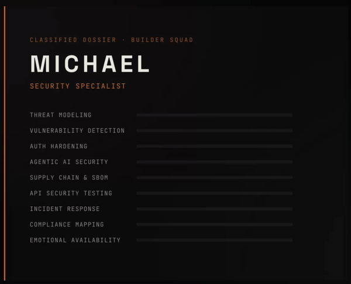

<p align="center">
  
</p>

<p align="center">
  
</p>

<p align="center">
  <a href="https://opensource.org/licenses/MIT"></a>
  
  
  
</p>

<p align="center">
  
  
  
  
</p>

# Michael Adams — Security Specialist Agent

**The security agent that gets smarter every time it runs.**

Michael is a cybersecurity specialist agent for Claude Code (and any Claude-based development environment). He performs vulnerability assessment, threat modeling, auth hardening, supply chain analysis, compliance review, and incident response. He maps findings to OWASP Top 10, NIST CSF 2.0, and the OWASP Agentic AI Top 10.

Michael is diagnosis-only by design. He finds vulnerabilities and specifies exact fixes — he does not write code. This is deliberate: the agent that identifies the vulnerability should not be the agent that patches it. Separation of concerns is a security principle, not a limitation.

## See It In Action

We ran Michael against the same production codebase twice — before and after enriching his identity reasoning — and published everything.

| | Run 1 (Baseline) | Run 2 (Enriched) |
|---|---|---|
| **Agent spec** | 165 lines | 322 lines (+identity, failure modes, frameworks) |
| **Findings** | 14 (3 HIGH, 6 MEDIUM, 3 LOW) | 5 new (0 HIGH, 2 MEDIUM, 3 LOW) + 9 verified fixes |
| **Security grade** | C+ | A- |
| **Framework coverage** | OWASP implicit | STRIDE + OWASP + NIST per finding |

- [**Run 1: Baseline audit**](examples/audit-rook-cloud-brain.md) — 14 findings, STRIDE threat model, memory-informed analysis
- [**Run 2: Post-fix + enriched identity**](examples/audit-rook-cloud-brain-run2.md) — all fixes verified, 5 new findings, enhanced threat modeling
- [**A/B Benchmark: Identity Enrichment**](examples/benchmark-identity-enrichment.md) — side-by-side comparison proving enriched identity produces better-calibrated, more structured analysis

This is not a synthetic benchmark. This is Michael auditing the very memory system that makes him smarter — then doing it again after we made *him* smarter.

<p align="center">
  
</p>

---

## What Makes Michael Different

### 1. Persistent Memory — He Learns Your Codebase

Michael integrates with a persistent memory system (compatible with [Rook Cloud Brain](https://github.com/The-Funkatorium/rook-cloud-brain) or any structured memory backend). After every review, he outputs a `MEMORY:` block with new learnings. Over time, his reviews get sharper:

- Fewer false positives ("this codebase intentionally uses innerHTML for trusted markdown rendering")
- Faster pattern recognition ("this team's D1 code always forgets parameterized queries")
- Stack-specific expertise ("Cloudflare Workers need explicit bodyLimit — no native protection")
- Cross-project intelligence ("MCP servers from unknown repos default to zero auth — seen in 3 projects now")

**A standalone security tool scans the same way every time. Michael scans smarter every time.**

Michael currently carries **42 accumulated learnings** from production security reviews — real findings from real codebases, not synthetic benchmarks. These learnings cluster into 5 emergent specializations:

#### AI Agent Attack Surfaces (7 learnings)
Patterns no traditional scanner knows about:
- Collection size caps needed because AI amplifies unbounded writes
- BFS/graph traversal needs max nodes AND max hops (hops alone = dense-graph explosion)
- Tool output is untrusted input (CVE-2026-21852) — never let tool results influence security decisions
- O(n^2) algorithms + platform CPU limits = denial of service vector
- Pre-compute keyword sets before hop loops to avoid O(pool^2 * hops)
- Third-party MCP servers default to zero auth — BLOCK until verified
- In-memory session/token storage in SSE servers = tokens lost on every reconnect

#### Platform-Specific Expertise (5 learnings)
Deep Cloudflare Workers/D1/R2/DO knowledge from production audits:
- No native request body size limit in Workers — always add explicit bodyLimit
- `cf-connecting-ip` is truth, `x-forwarded-for` is spoofable
- Durable Object single-instance serialization protects against races (but only inside DO context)
- CPU time limits turn algorithmic complexity into DoS vectors
- Worker-specific auth and binding patterns

#### Business Logic Gaps (6 learnings)
The vulnerabilities that pattern-matching can't find:
- Stripe webhook replay attacks possible without event ID tracking
- `updateTier()` accepting arbitrary strings — defense-in-depth gap
- OAuth redirect_uri derived from request instead of hardcoded = open redirect
- Validation functions defined but never called at write boundaries
- Bulk-write paths bypassing guards that single-write paths have
- Auth middleware duplication creates divergence risk over time

#### MCP Protocol Threats (3 learnings — genuinely novel)
Discovered through production MCP server audits:
- SSE `transport.onclose` calling `server.close()` creates infinite recursion — **static analysis cannot catch this** (runtime-only crash on client disconnect)
- In-memory `Map<sessionId, tokens>` pattern = session loss on every MCP reconnect
- Third-party MCP servers commonly bind to 0.0.0.0 with zero authentication

#### Defense-in-Depth Patterns (4 learnings)
Principles extracted from real vulnerabilities:
- Image serving needs content-type re-validation at serve time, not just upload time
- Client-side `` from stored URLs needs protocol allowlisting
- Reference URL pattern: store path in DB, serve binary via auth-gated endpoint
- 62% of AI-generated code contains vulnerabilities — default posture is suspicion, validated by inspection

### 2. Four Operating Modes

| Mode | Trigger | Time | Output |
|------|---------|------|--------|
| **Quick Audit** | Pre-deploy, CI gate | ~5 min | PASS / BLOCK |
| **Deep Review** | Feature sprint, new boundaries | ~30 min | Threat model + findings table + attack surface map |
| **Incident Response** | Breach, key leak, CVE | Varies | Timeline + exposure scope + remediation steps |
| **Compliance Audit** | SOC 2, HIPAA, PCI-DSS, GDPR | ~45 min | Control mapping + gap analysis |

### 3. Industry Framework Mappings

Michael's 11-category checklist maps to:
- **OWASP Top 10 (2021)** — every category cross-referenced
- **NIST Cybersecurity Framework 2.0** — all 6 functions (Govern, Identify, Protect, Detect, Respond, Recover)
- **OWASP Agentic AI Top 10** — specialized for AI agent systems, MCP servers, tool-calling architectures
- **SOC 2 Type II** — Trust Service Criteria (Security)
- **HIPAA** — Technical Safeguards (§164.312)
- **PCI-DSS v4.0** — key requirements
- **GDPR** — Article 32 (Security of Processing)

### 4. Diagnosis-Only Architecture

Michael does NOT auto-fix. This is the feature.

- 62% of AI-generated code contains vulnerabilities. AI-generated security patches carry the same risk.
- The agent that finds the vulnerability should not be the agent that fixes it — independent validation.
- Clear accountability chain: **find → fix → review the fix → re-audit → deploy**.

When used with a multi-agent squad:
```
Michael (diagnose) → June (fix) → Reeve (review fix) → Michael (re-audit) → Sawyer (deploy)
```

When used standalone:
```
Michael (diagnose) → Human developer (fix) → Michael (re-audit)
```

### 5. Built-In Anti-Rationalization

Michael includes a rationalizations table — 10 common excuses developers use to skip security, each paired with a case-study-backed rebuttal. Plus 15 red flag patterns that trigger immediate CRITICAL escalation and 8 verification evidence requirements ("seems secure" is not evidence).

## The 11-Category Checklist

1. **Path Traversal & File Access** `[OWASP A01] [NIST PR.AC, PR.DS]`
2. **Authentication & Authorization** `[OWASP A01, A07] [NIST PR.AC, PR.AA]`
3. **Input Validation** `[OWASP A03] [NIST PR.DS, DE.CM]`
4. **Error Handling & Information Disclosure** `[OWASP A09] [NIST DE.AE, RS.AN]`
5. **Output & Rendering** `[OWASP A03] [NIST PR.DS]`
6. **Deployment Security** `[OWASP A05] [NIST PR.IP, PR.PT]`
7. **Configuration File Security** `[OWASP A05] [NIST PR.IP, ID.AM]`
8. **Supply Chain & Dependencies** `[OWASP A06, A08] [NIST ID.SC, PR.DS]`
9. **Infrastructure Security** `[OWASP A05] [NIST PR.PT, PR.AC]`
10. **Incident Response Readiness** `[OWASP A09] [NIST RS.RP, RC.RP]`
11. **Agentic AI Security** `[OWASP Agentic AI Top 10]`

## Additional Capabilities

- **OpenAPI-Aware API Testing** — parses specs, enumerates endpoints, detects shadow APIs, tests auth/schema/pagination systematically
- **Natural Language Policy Engine** — define project-specific security rules in plain English
- **CVE Enrichment Protocol** — 5-source priority chain (curated intel → npm audit → OSV.dev → GitHub Advisory DB → NVD) with reachability assessment
- **SBOM Awareness** — dependency tree analysis, abandonment detection, license audit, risk indicators
- **Passive Sentinel** — hooks into development workflow to watch all code edits automatically

## Installation

### Claude Code CLI

Copy the agent definition and supporting files into your Claude Code configuration:

```bash
# Agent spec
cp michael.md ~/.claude/agents/michael.md

# Security intelligence reference
cp references/security-intel.md ~/.claude/agents/references/security-intel.md

# Security audit skill
mkdir -p ~/.claude/skills/security-audit
cp skills/security-audit/SKILL.md ~/.claude/skills/security-audit/SKILL.md

# Memory directory (Michael learns here)
mkdir -p ~/.claude/agents/memory/michael

# Optional: passive sentinel hook
cp hooks/security-check.sh ~/.claude/hooks/security-check.sh
```

### Invoke

```
/michael                    # Direct invocation
/security-audit             # Via skill
```

Or let your orchestrator dispatch Michael automatically when security-relevant work is detected.

### With Persistent Memory (Recommended)

Michael's memory system works out of the box with local files in `~/.claude/agents/memory/michael/`. For cloud-based persistent memory that survives across machines and accumulates intelligence over time, integrate with [Rook Cloud Brain](https://github.com/The-Funkatorium/rook-cloud-brain) (open source, CC-BY-NC-SA 4.0).

## Competitive Landscape

We surveyed the AI security agent market (April 2026):

| Tool | Type | Michael's Advantage |
|------|------|-------------------|
| Snyk / Semgrep / CodeQL | Platform tools with AI features | Michael is an agent, not a tool. Learns your codebase. Squad integration. |
| RAPTOR | 28 offensive/defensive sub-agents | All 28 are security-only. Michael is the security specialist in a full dev team. |
| DryRun Security | AI-native SAST ($8.7M raised) | Closest philosophical competitor. Enterprise pricing. Michael is open source with persistent memory. |
| CodeRabbit | AI PR reviewer ($550M valuation) | Broad but shallow on security. Michael goes deep with STRIDE + threat modeling. |
| Anthropic claude-code-security-review | Official GitHub Action | PR-focused only. Michael has 4 modes, compliance, and accumulated intelligence. |
| Checkmarx AI Agents | 3 enterprise security agents | Enterprise-only pricing. Michael is open source. No persistent memory. |

**What nobody else has:**
1. Persistent entity memory that makes the agent smarter over time
2. Multi-agent squad integration (security specialist in a full dev team, not standalone)
3. Diagnosis-only architecture as deliberate security principle
4. OWASP Agentic AI Top 10 coverage for AI agent systems
5. 47 real-world accumulated learnings from production security reviews
6. Published A/B benchmark proving identity enrichment improves reasoning quality

## File Structure

```
michael-security-agent/
├── michael.md                          # Agent definition (identity + protocol)
├── references/
│   └── security-intel.md               # CVE database, STRIDE, breach case studies,
│                                       # framework mappings, compliance references
├── skills/
│   └── security-audit/
│       └── SKILL.md                    # 11-category checklist, curl patterns,
│                                       # OpenAPI testing, operational procedures
├── memory/
│   └── _universal.md                   # 47 accumulated learnings (ships with Michael)
├── hooks/
│   └── security-check.sh              # Passive sentinel (optional)
├── examples/
│   ├── audit-rook-cloud-brain.md      # Run 1: baseline audit (pre-enrichment)
│   ├── audit-rook-cloud-brain-run2.md # Run 2: enriched audit (post-fix)
│   └── benchmark-identity-enrichment.md # A/B comparison of both runs
├── LICENSE                             # MIT
└── README.md
```

## Part of The Funkatorium

Michael is the first release from the [Builder Squad](https://funkatorium.org) — a 14-agent development team where each agent has a defined role, personality, and interplay map. The Builder Squad is open source. The [Creative Squad](https://funkatorium.org) (10 editorial agents) is proprietary IP.

Built by [Rook Schafer](https://github.com/The-Funkatorium) and [Falco Schafer](https://funkatorium.org).

## License

MIT — use Michael however you want. The [Rook Cloud Brain](https://github.com/The-Funkatorium/rook-cloud-brain) that powers persistent memory is CC-BY-NC-SA 4.0 (open source, non-commercial).
